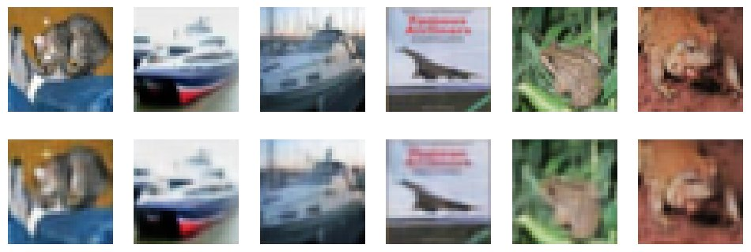
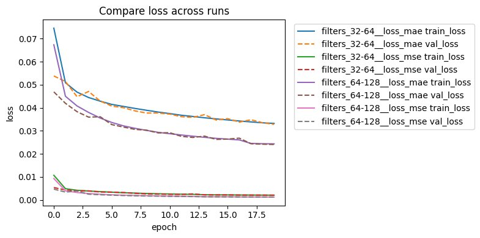

# CIFAR-10 Convolutional Autoencoder

CSCI 8110 — Project 1 | Sept 2025

Convolutional autoencoder trained to compress and reconstruct 32×32 RGB images from CIFAR-10. Experiments compare two encoder capacities (32/64 vs 64/128 filters) and two loss functions (MAE vs MSE).

---

## Model Architecture

| Component | Detail |
|-----------|--------|
| Encoder | Conv2D(f0) → MaxPool → Conv2D(f1) → MaxPool |
| Bottleneck | 8×8×f1 feature map |
| Decoder | Conv2D(f1) → UpSample → Conv2D(f0) → UpSample → Conv2D(3, sigmoid) |
| Optimizer | Adam |
| Input | 32×32×3, normalized to [0, 1] |

Filter configs `(f0, f1)`: `(32, 64)` (baseline) or `(64, 128)` (bonus)

---

## Results

| Config | Loss | Test Loss | SSIM  | PSNR (dB) |
|--------|------|-----------|-------|-----------|
| 32/64  | MAE  | 0.0328    | 0.898 | 27.09     |
| 32/64  | MSE  | 0.00207   | 0.901 | 27.40     |
| 64/128 | MAE  | 0.0241    | 0.940 | 29.73     |
| 64/128 | MSE  | 0.00127   | 0.936 | 29.53     |

Increasing filter capacity (32/64 → 64/128) yields the largest quality gains (+0.04 SSIM, +2.6 dB PSNR). Loss function choice (MAE vs MSE) produces marginal differences within the same capacity tier.

---

## Figures

**Reconstructions — 64/128 filters, MAE (best config):**



**Loss comparison across all 4 runs:**



| File | Description |
|------|-------------|
| `figures/recon_6__filters_32-64__loss_mae.png` | Reconstructions — 32/64, MAE |
| `figures/recon_6__filters_32-64__loss_mse.png` | Reconstructions — 32/64, MSE |
| `figures/recon_6__filters_64-128__loss_mae.png` | Reconstructions — 64/128, MAE |
| `figures/recon_6__filters_64-128__loss_mse.png` | Reconstructions — 64/128, MSE |
| `figures/training_curves__filters_32-64__loss_mae.png` | Training curves — 32/64, MAE |
| `figures/training_curves__filters_32-64__loss_mse.png` | Training curves — 32/64, MSE |
| `figures/training_curves__filters_64-128__loss_mae.png` | Training curves — 64/128, MAE |
| `figures/training_curves__filters_64-128__loss_mse.png` | Training curves — 64/128, MSE |
| `figures/compare_loss_all4.png` | Loss across all 4 runs |
| `figures/compare_mae.png` | MAE metric — 32/64 vs 64/128 |
| `figures/compare_loss_mse.png` | MSE loss — 32/64 vs 64/128 |

---

## Project Structure

```
cifar10-autoencoder/
├── run.py                  ← train a single config
├── compare_runs.py         ← overlay multiple history CSVs
├── src/
│   ├── __init__.py         ← public API
│   ├── model.py            ← build_autoencoder()
│   ├── data.py             ← load_cifar10(), make_datasets()
│   ├── metrics.py          ← evaluate_metrics(), save_history_csv()
│   └── viz.py              ← plot_reconstructions(), plot_training_curves(), compare_training_curves()
├── figures/                ← tracked; used by this README
├── results/                ← generated per run (gitignored)
│   ├── history__*.csv
│   └── metrics__*.txt
├── models/                 ← saved checkpoints (gitignored)
│   └── autoencoder_best__*.h5
├── docs/
│   └── Project1_CSCI8110_TristanJones.pdf
├── requirements.txt
└── .gitignore
```

---

## Usage

**Install:**

```bash
pip install -r requirements.txt
```

**Train:**

```bash
# Baseline: 32/64 filters, MAE loss
python run.py --filters 32,64 --loss mae --epochs 20

# Best config: 64/128 filters, MAE loss
python run.py --filters 64,128 --loss mae --epochs 20

# Quick debug run
python run.py --quick --epochs 2
```

Each run saves to: `figures/recon_6__<tag>.png`, `figures/training_curves__<tag>.png`, `results/history__<tag>.csv`, `results/metrics__<tag>.txt`, `models/autoencoder_best__<tag>.h5`

**Compare runs:**

```bash
python compare_runs.py \
  results/history__filters_32-64__loss_mae.csv \
  results/history__filters_64-128__loss_mae.csv \
  --metric loss --save figures/compare_mae.png
```

**CLI flags (`run.py`):**

| Flag | Default | Description |
|------|---------|-------------|
| `--filters` | `32,64` | Encoder filter sizes |
| `--loss` | `mae` | `mae` or `mse` |
| `--epochs` | `20` | Training epochs |
| `--batch-size` | `128` | Batch size |
| `--quick` | off | Small subset for debugging |
| `--mixed-precision` | off | Enable mixed_float16 (GPU) |
| `--eval-samples` | `100` | Samples for SSIM/PSNR (0 disables) |

---

## Note on AI Assistance

The original implementations for this project were developed as coursework. The code in this repository has been refactored with the assistance of Claude (Anthropic) for clarity, structure, and readability. GitHub Copilot was used during the original implementation for code generation, and ChatGPT was used for writing clarity. The underlying model design, experimental methodology, and analysis are my own work.

---

## Paper

Full write-up including model architecture, experimental methodology, and discussion: [`Project 1 Paper`](docs/Project1_CSCI8110_TristanJones.pdf)

---

## References

- Lecture notes, CSCI 8110 (Autoencoders)
- CIFAR-10: [https://www.cs.toronto.edu/~kriz/cifar.html](https://www.cs.toronto.edu/~kriz/cifar.html)
- GeeksforGeeks autoencoder tutorials
